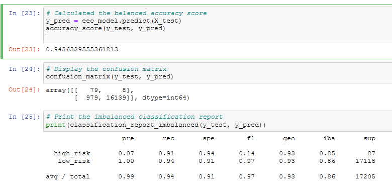

# Credit_Risk_Analysis

## Overview
The purpose of this analysis is to feed the credit card dataset on different machine learning algorithims to determine their respective performances on assessing credit risk i.e. low/high risk applicants; specifically, we would like the algorithim to identify applicants that are high risk This will allow our company to hopefully choose a robust algorithim when determining applicant's credit risk for our company.

## Results

This section provides the results of all six machine learning algorithims.

- Oversampling: Using the oversampling algorithim, we achieved a 67% accuracy score along with 1% precision and 66% recall on predicting high risk applicants. 

- SMOTE: Using the SMOTE algorithim, we achieved a 64% accuracy score along with 1% precision and 62% recall on predicting high risk applicants. 

- Cluster Centroids: Using the Cluster Centroids algorithim, we achieved a 45% accuracy score along with 1% precision and 61% recall on predicting high risk applicants. 

- SMOTEENN: Using the SMOTEENN algorithim, we achieved a 57% accuracy score along with 1% precision and 74% recall on predicting high risk applicants. 

- Balanced Random Forest: Using the Balanced Random Forest algorithim, we achieved a 91% accuracy score along with 4% precision and 67% recall on predicting high risk applicants.  

- Easy Ensemble: Using the Easy Ensemble algorithim, we achieved a 94% accuracy score along with 7% precision and 91% recall on predicting high risk applicants. 

### Summary

Each of the three metrics mentioned are highly important to the company, where accuracy tests the overall robustness of the model, precision relates to whether someone is correctly/incorrectly flagged as a high risk applicant, while recall relates to whether a high risk individual is correctly identified; the latter two metrics require a balance between profit i.e. precision, rejection of low risk applicants, and bad debt risk i.e. recall, accepting high risk applicants. 

Based on the above results, it would appear that the Easy Ensemble algorithim as it scores higher in all three metrics and therefore shold be considered to be used going forward. A qualifier for the model is that the Easy Ensemble alogirithims uses boosting and may be more prone to overfitting i.e. weak learners are sequentially trained  vs random forest where they are not and less exposed to this issue.